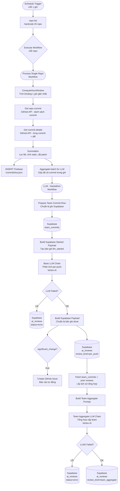

# AI Hackathon Workflow Handover

> **Phiên bản tài liệu:** 1.0 — Ngày: 2026-05-21  
> **Người tạo:** Senior Technical Writer + n8n Solution Architect  
> **Mục tiêu:** Giúp người tiếp quản hiểu toàn bộ hệ thống mà không cần đọc từng dòng code

---

## 1. Tổng quan hệ thống

Hệ thống này là **AI Technical Auditor cho Hackathon SEAL Spring 2026**. Nó tự động theo dõi 25 repo GitHub của các team tham gia hackathon, quét commit mới theo chu kỳ mỗi giờ, lấy nội dung thay đổi code (diff), rồi dùng **Google Vertex AI (Gemini)** để phân tích kỹ thuật từng lần push.

Kết quả phân tích bao gồm:
- Đánh giá tech stack, RAG maturity, agent intelligence của từng team
- Review per-push: phân tích nhanh mỗi lần push
- Review aggregate cấp team: tổng hợp toàn bộ lịch sử, chấm điểm theo rubric R1/R2
- Gợi ý câu hỏi cho ban giám khảo khi demo
- Tự động tạo GitHub Issue khi phát hiện thay đổi quan trọng

Dữ liệu được lưu vào:
- **Firebase Realtime Database**: raw commit data (nhanh, dễ tra cứu)
- **Supabase**: commit metadata + toàn bộ kết quả phân tích AI (dùng để query, lọc, xuất báo cáo)

---

## 2. Sơ đồ luồng tổng thể



**Luồng tóm tắt bằng text:**
```
[cron-job] → mỗi giờ lấy 25 repo
    → [Process Single Repo] × 25 lần song song
        → GitHub API lấy commit + diff
        → Firebase lưu raw commit
        → [LLM - Hackathon]
            → Supabase lưu team_commits
            → Vertex AI phân tích per-push → Supabase ai_reviews (per_push)
            → Nếu thay đổi lớn → GitHub Issue
            → Vertex AI tổng hợp cấp team → Supabase ai_reviews (team_aggregate)
```

---

## 3. Workflow 1: cron-job

### Vai trò
Đây là **điểm khởi động toàn bộ hệ thống**. Workflow này chạy định kỳ, sinh ra danh sách repo cần quét, rồi gọi sang Workflow 2 cho từng repo.

### Trigger chạy khi nào
- **Schedule Trigger** — cấu hình chạy mỗi **1 giờ**
- **Lưu ý quan trọng:** Hiện tại node Schedule Trigger đang ở trạng thái **`disabled: true`** (tắt). Cần bật lại trước khi chạy production.

### Danh sách repo lấy từ đâu
Repo được **hardcode trực tiếp** trong node `repo list` (Code node JavaScript). Danh sách 25 repo thuộc tổ chức `SEAL-HACKATHON-SPRING2026`:

| STT | Team |
|-----|------|
| 1 | NEWBIEs |
| 2 | VAIK |
| 3 | KQL |
| 4 | BitMindz |
| 5 | RAGNAROK |
| 6 | NGUHANHSON |
| 7 | Try |
| 8 | FULI |
| 9 | LearingAgent |
| 10 | Red-Team-Gang |
| 11 | Passion-Ducks |
| 12 | Slothub |
| 13 | 404NotFound |
| 14 | Underrated |
| 15 | APX |
| 16 | Dep-trai-co-gi-sai |
| 17 | Epoch-0 |
| 18 | Whaledone |
| 19 | WORKA-GANG |
| 20 | The-ORCA |
| 21 | YAG |
| 22 | Aqua |
| 23 | ORTT |
| 24 | food-enjoyer |
| 25 | 5-anh-em-sieu-nhan |

### Luồng xử lý từng node

| Node | Loại | Làm gì trong thực tế |
|------|------|----------------------|
| **Schedule Trigger** | Trigger | Kích hoạt workflow mỗi giờ một lần |
| **repo list** | Code (JS) | Đọc mảng 25 chuỗi `"owner/repo"`, tách thành `{owner, repo}` để output ra 25 item |
| **Call 'Process Single Repo copy'** | Execute Workflow | Gọi Workflow 2 theo mode `each` — tức là gọi tuần tự (hoặc song song tùy cấu hình n8n) cho từng repo |

### Input/Output

- **Input:** Không có input từ ngoài (tự kích hoạt theo schedule)
- **Output sang Workflow 2:** `{ owner: "SEAL-HACKATHON-SPRING2026", repo: "TênTeam" }`

### Điểm cần kiểm tra

> **QUAN TRỌNG:** Node Execute Workflow đang trỏ đến `"Process Single Repo copy"` (ID: `ApLomXftwZZiXznu`), không phải `"Process Single Repo"` (ID: `TYSHp6nIpDTusmPNzQ2to`). Sau khi import lại, workflow ID sẽ thay đổi — **phải map lại** node này.

---

## 4. Workflow 2: Process Single Repo

### Vai trò
Nhận thông tin một repo, gọi GitHub API để lấy commit mới trong 1 giờ vừa qua, xử lý diff, lưu vào Firebase, rồi gói gọn dữ liệu để gửi sang Workflow 3 phân tích AI.

### Trigger
- **Execute Workflow Trigger** (`passthrough` mode) — nhận input từ cron-job

### Luồng xử lý từng node

#### Node 1: `cron-job` (Execute Workflow Trigger)
Đây là điểm nhận dữ liệu từ Workflow 1. Input có dạng:
```json
{ "owner": "SEAL-HACKATHON-SPRING2026", "repo": "NEWBIEs" }
```

#### Node 2: `ComputeHourWindow`
Tính khoảng thời gian 1 giờ gần nhất tính từ thời điểm workflow chạy:
```
since = now - 1 giờ
until = now
```
Đồng thời bổ sung `team_id` (= tên repo), `repo_name` (= `owner/repo`).

#### Node 3: `Get repo commit`
Gọi GitHub REST API:
```
GET https://api.github.com/repos/{owner}/{repo}/commits
  ?per_page=100&since={since}&until={until}
```
- Dùng **Bearer Auth** (GitHub Token)
- `onError: continueErrorOutput` — nếu lỗi (repo không tồn tại, 403, v.v.) thì bỏ qua, không crash cả luồng
- Trả về danh sách commit (tối đa 100 commit)

#### Node 4: `Get commit details`
Với mỗi commit SHA từ bước trên, gọi tiếp:
```
GET https://api.github.com/repos/{owner}/{repo}/commits/{sha}
```
Lấy đầy đủ thông tin: danh sách file thay đổi, số dòng thêm/xóa, nội dung patch (diff).

#### Node 5: `Summation`
Node Code quan trọng nhất ở Workflow 2. Xử lý diff từng commit:

- **Bỏ qua các file:** `.gitignore`, `package-lock.json`, `yarn.lock`, `.env`, `README.md`
- **Phát hiện config file:** `requirements.txt`, `package.json`, `pyproject.toml`, `docker-compose.yml`
- **Cắt patch dài:** Mỗi file patch bị cắt tại **3.000 ký tự**, thêm `... [Truncated] ...`
- **Chuyển timezone:** Timestamp commit từ UTC chuyển sang **UTC+7** (giờ Việt Nam)
- **Tạo 2 payload:**
  - `firebaseData`: metadata không có diff content (để lưu Firebase)
  - `aiData`: giống firebaseData nhưng có thêm `diff_content` (để gửi AI)

#### Node 6: `INSERT Firebase` (song song với node 7)
Ghi raw commit lên Firebase Realtime Database:
```
PUT https://sealhackathon-spring-2026-default-rtdb.asia-southeast1.firebasedatabase.app/commit/{commit_sha}.json
```
Dùng **Google Service Account** để xác thực. Mỗi commit SHA là một key riêng biệt.

#### Node 7: `Aggregate batch for LLM` (song song với node 6)
Gộp toàn bộ commit trong giờ vừa qua thành một batch duy nhất:
- Tạo `activity_log`: chuỗi mô tả ngắn từng commit (SHA ngắn + message + files)
- Gộp tất cả diff content, phân cách bằng `=== COMMIT-BOUNDARY ===`
- **Cắt tổng diff** tại **50.000 ký tự** nếu quá dài
- Output: `{ repo_name, team_id, commit_sha, commit_count, activity_log, code_changes_detail, cron_batch_review: true }`

#### Node 8: `Call 'LLM - Hackathon'`
Gọi Workflow 3 với toàn bộ batch đã chuẩn bị.

### Input/Output của Workflow 2

| | Mô tả |
|--|-------|
| **Input** | `{ owner, repo }` từ cron-job |
| **Output → Firebase** | Raw commit per SHA (không có diff) |
| **Output → Workflow 3** | Batch gộp tất cả commit trong 1 giờ |

---

## 5. Workflow 3: LLM - Hackathon

### Vai trò
Workflow AI cốt lõi. Nhận batch commit từ Workflow 2, lưu vào Supabase, phân tích bằng LLM, tổng hợp cấp team, tùy chọn tạo GitHub Issue.

### Luồng xử lý chi tiết

#### Bước 1 — Nhận input và lưu team_commits

**Node: `When Executed by Another Workflow`**  
Nhận toàn bộ payload batch từ Workflow 2.

**Node: `Prepare Team Commit Row`**  
Extract các field cần thiết (`team_id`, `commit_sha`, `repo_name`, `author`, `commit_message`, `committed_at`) và thêm `source: 'webhook'`. Giữ toàn bộ payload gốc trong field `_passthrough` để dùng lại ở bước sau.

**Node: `Create Team Commit Row`**  
INSERT vào bảng Supabase `team_commits`. Bỏ qua field `_passthrough` khi ghi (dùng `inputsToIgnore`).

**Node: `Team Commit Duplicate?`**  
Kiểm tra xem ghi có bị lỗi duplicate không:
- **Duplicate (lỗi):** Đi sang `Build Row For Update Team Commit` → `Update Team Commit Row`
- **Thành công:** Đi thẳng sang `Restore After Team Commit Upsert`

Sau cả hai nhánh đều đến `Restore After Team Commit Upsert` để khôi phục payload gốc (`_passthrough`).

---

#### Bước 2 — Phân tích per-push bằng LLM

**Node: `Build Supabase Started Payload`**  
Tạo bản ghi khởi đầu với `status: 'llm_started'` — đánh dấu LLM đang xử lý. Cấu trúc:
```json
{
  "team_id": "...",
  "repo_name": "...",
  "commit_sha": "...",
  "review_kind": "per_push",
  "status": "llm_started",
  "structured_output": { "initial_input": { ...batch data... } }
}
```

**Node: `Google Vertex Chat Model`**  
Model AI dùng cho toàn bộ workflow. Project ID: `project-b4a71f8c-62c9-4bda-9cd`. Model mặc định của `lmChatGoogleVertex` trong n8n (cần kiểm tra version Gemini đang dùng trên Vertex Console).

**Node: `Structured Output Parser`**  
Ép output LLM về đúng schema JSON đã định nghĩa (có `autoFix: true` để tự sửa lỗi format). Schema bao gồm:
- `tech_stack` (frameworks, llm_models, vector_db, agent_frameworks, third_party_tools)
- `inventory_exhaustive` (liệt kê đầy đủ mọi công nghệ)
- `agent_intelligence` (detected_skills, reasoning_pattern, has_agent_config_files)
- `rag_maturity` (level: Basic/Advanced/Agentic-RAG, features_detected)
- `overall_picture` (project_about, push_summary, significant_change, ...)
- `assessment` (advantages, disadvantages, improvement_areas, security, completeness, ...)
- `suggested_test_cases`, `suggested_questions_for_team`, `suggested_prompt_refinement`

**Node: `Basic LLM Chain`**  
Gửi prompt phân tích per-push đến Vertex AI. Prompt hướng dẫn AI:
- Phân tích diff code, tập trung vào RAG pipeline và phi chức năng (security, observability, performance)
- Nhận diện tech stack, RAG level
- Viết `push_summary` với số commit trong batch
- Trả về JSON hợp lệ theo schema trên
- Có `onError: continueErrorOutput` để xử lý lỗi

**Node: `LLM Failed?`**  
Kiểm tra xem LLM có báo lỗi không:
- **Lỗi:** `Build Supabase Error Payload` → `Update Supabase Error` (bảng `ai_reviews`, ghi `status: 'error'`)
- **OK:** `Build Supabase Payload` → tiếp tục

**Node: `Build Supabase Payload`**  
Chuẩn hóa output LLM (xử lý trường hợp có lớp `output.output.xxx`), tạo payload với `status: 'done'`, `review_kind: 'per_push'`.

**Node: `Create Supabase Review`**  
INSERT vào bảng `ai_reviews`. Có `continueOnFail: true`.

**Node: `Per Push Review Create Failed?`**  
Nếu INSERT bị lỗi (thường do duplicate key):
- **Lỗi/duplicate:** `Build Data For Update AI Review` → `Update AI Review On Duplicate` (UPDATE theo filter `team_id + commit_sha + review_kind`)
- **Thành công:** Tiếp tục sang bước aggregate

**Node: `isChange?`** (chạy song song sau Build Supabase Payload)  
Kiểm tra `overall_picture.significant_change === true`. Nếu đúng → tạo GitHub Issue.

**Node: `Create an issue`**  
Tạo GitHub Issue với báo cáo phân tích đầy đủ bằng Markdown. **Lưu ý:** Node này hiện tham chiếu đến các node không tồn tại trong luồng cron (xem mục rủi ro).

---

#### Bước 3 — Tổng hợp cấp team (Aggregate)

Sau khi per-push review xong, workflow tiếp tục tổng hợp.

**Node: `Prepare Fetch Aggregate Context`**  
Chuẩn bị `team_id` và giữ `_passthrough` để query Supabase.

**Node: `Get All Team Commits Agg`**  
Lấy tối đa 200 commit gần nhất của team từ bảng `team_commits`, sắp xếp theo `committed_at ASC`.

**Node: `Collapse Commits For Aggregate`**  
Gom lại thành list metadata commit ngắn gọn (sha, timestamp, author, message cắt 500 ký tự).

**Node: `Get Prior Push Reviews Agg`** (chạy song song)  
Lấy tối đa 40 per-push review gần nhất (status='done') của team từ bảng `ai_reviews`.

**Node: `Merge Bundle And Reviews`**  
Merge 2 luồng (commits + reviews) lại.

**Node: `Merge Aggregate Context`**  
Kết hợp thành `aggregate_context = { commits, prior_push_reviews }`.

**Node: `Build Team Aggregate Prompt`**  
Tạo prompt tổng hợp, bao gồm:
- Lịch sử toàn bộ commit của team
- Tất cả per-push review đã lưu
- Kết quả phân tích push hiện tại

**Node: `Structured Output Parser Team`**  
Schema mở rộng hơn per-push, thêm:
- `criteria_comments`: Rubric R1 (5 tiêu chí vòng 1) và R2 (5 tiêu chí vòng 2) — dùng để chấm điểm hackathon
- `smb_scale_advisory`: tư vấn scale cho doanh nghiệp vừa/nhỏ (7 trường)
- `overall_picture.historical_synthesis`, `evolution_notes`: mô tả tiến hóa kỹ thuật qua thời gian

**Node: `Team Aggregate LLM Chain`**  
Gọi LLM lần 2 để tổng hợp cấp team. Prompt yêu cầu:
- Phân tích toàn diện RAG + NFR xuyên suốt lịch sử
- Chấm rubric R1/R2 (không điểm số, dùng thang Xuất sắc/Tốt/Khá/Trung bình/Yếu)
- Gợi ý SMB scale advisory
- Không bịa số liệu, không bịa commit

**Node: `LLM2 Failed?`**  
Xử lý lỗi tương tự per-push:
- **Lỗi:** `Build Supabase Aggregate Error Payload` → `Update Supabase Aggregate Error`
- **OK:** `Build Supabase Aggregate Payload` → `Create Supabase Aggregate Review`

**Node: `Create Supabase Aggregate Review`**  
INSERT bản ghi tổng hợp vào `ai_reviews` với `review_kind: 'team_aggregate'`.

---

## 6. Database cần có

### Firebase Realtime Database

**URL:** `https://sealhackathon-spring-2026-default-rtdb.asia-southeast1.firebasedatabase.app`

**Path:** `/commit/{commit_sha}.json`

Mỗi commit SHA là một key. Dữ liệu lưu:

```json
{
  "commit_sha": "abc1234...",
  "repo_name": "SEAL-HACKATHON-SPRING2026/NEWBIEs",
  "team_id": "NEWBIEs",
  "author": "Nguyen Van A",
  "timestamp": "2026-05-21T10:30:00+07:00",
  "commit_message": "Add RAG pipeline",
  "branch": "main",
  "stats": {
    "additions": 120,
    "deletions": 5,
    "files_changed_count": 3
  },
  "modified_files_list": ["src/rag.py", "config/settings.py"],
  "config_files_detected": ["requirements.txt"]
}
```

> **Lưu ý:** Firebase **không** lưu diff content — chỉ lưu metadata.

---

### Supabase

#### Bảng `team_commits`

Lưu metadata mỗi commit đã quét. Schema đề xuất:

```sql
CREATE TABLE team_commits (
  id            BIGSERIAL PRIMARY KEY,
  team_id       TEXT NOT NULL,
  commit_sha    TEXT NOT NULL,
  repo_name     TEXT,
  author        TEXT,
  commit_message TEXT,
  committed_at  TIMESTAMPTZ,
  source        TEXT DEFAULT 'webhook',
  created_at    TIMESTAMPTZ DEFAULT NOW(),
  UNIQUE (team_id, commit_sha)  -- dùng để upsert
);

CREATE INDEX idx_team_commits_team_id ON team_commits(team_id);
CREATE INDEX idx_team_commits_committed_at ON team_commits(committed_at);
```

#### Bảng `ai_reviews`

Lưu kết quả phân tích AI. Schema đề xuất:

```sql
CREATE TABLE ai_reviews (
  id                BIGSERIAL PRIMARY KEY,
  team_id           TEXT NOT NULL,
  repo_name         TEXT,
  commit_sha        TEXT NOT NULL,
  review_kind       TEXT NOT NULL,        -- 'per_push' hoặc 'team_aggregate'
  status            TEXT,                 -- 'llm_started', 'done', 'error'
  push_summary      TEXT,
  rag_level         TEXT,                 -- 'Basic', 'Advanced', 'Agentic-RAG'
  structured_output JSONB,               -- toàn bộ JSON output từ LLM
  input_code_length INTEGER,
  created_at        TIMESTAMPTZ DEFAULT NOW(),
  updated_at        TIMESTAMPTZ DEFAULT NOW(),
  UNIQUE (team_id, commit_sha, review_kind)  -- dùng để upsert
);

CREATE INDEX idx_ai_reviews_team_id ON ai_reviews(team_id);
CREATE INDEX idx_ai_reviews_review_kind ON ai_reviews(review_kind);
CREATE INDEX idx_ai_reviews_status ON ai_reviews(status);
```

> **Lưu ý:** Cột `structured_output` kiểu JSONB chứa toàn bộ output LLM, bao gồm `criteria_comments` (rubric R1/R2), `smb_scale_advisory`, `assessment`, `inventory_exhaustive`... Truy vấn bằng Supabase JSON operators hoặc PostgREST.

---

## 7. Credential / API cần chuẩn bị

| Credential | Dùng cho | Loại trong n8n | Tên trong workflow |
|------------|----------|-----------------|-------------------|
| **GitHub Token (đọc commit)** | Gọi GitHub API lấy commit list + diff | `httpBearerAuth` | "Bearer Auth account 2" |
| **GitHub API (tạo issue)** | Tạo GitHub Issue khi significant_change=true | `githubApi` | "HKT Account" |
| **Google Service Account** | Ghi Firebase Realtime Database | `googleApi` | "Google Service Account account" |
| **Google Service Account (Vertex)** | Gọi Vertex AI / Gemini LLM | `googleApi` | "Vertex" |
| **Supabase API** | Đọc/ghi bảng team_commits và ai_reviews | `supabaseApi` | "Supabase account" |

### Quyền cần thiết

| Credential | Quyền tối thiểu |
|------------|-----------------|
| GitHub Token (đọc) | `repo` scope (đọc private repo) hoặc `public_repo` nếu repo public |
| GitHub Token (tạo issue) | `repo` scope (tạo issue) |
| Google Service Account (Firebase) | Firebase Realtime Database: `read`, `write` trên path `/commit/` |
| Google Service Account (Vertex) | Vertex AI: `roles/aiplatform.user` trên project Vertex |
| Supabase | Anon key hoặc Service Role key có quyền SELECT, INSERT, UPDATE trên 2 bảng trên |

---

## 8. Công nghệ sử dụng

| Công nghệ | Vai trò trong hệ thống |
|-----------|------------------------|
| **n8n** | Nền tảng workflow automation, orchestrate toàn bộ pipeline |
| **GitHub REST API v3** | Lấy danh sách commit và diff code của từng repo |
| **GitHub Issues API** | Tạo issue tự động khi phát hiện thay đổi quan trọng |
| **JavaScript Code Node** | Xử lý logic (tính timestamp, lọc file, gộp batch, build payload) |
| **Firebase Realtime Database** | Lưu raw commit metadata, truy xuất nhanh theo SHA |
| **Supabase (PostgreSQL)** | Lưu commit metadata và kết quả phân tích AI có cấu trúc |
| **Google Vertex AI (Gemini)** | Model LLM phân tích code diff và tổng hợp cấp team |
| **LangChain node trong n8n** | `chainLlm` — gọi LLM với prompt + output parser |
| **Structured Output Parser** | Ép output LLM về JSON schema cố định (có autoFix) |
| **Execute Workflow node** | Gọi sub-workflow, kết nối 3 workflow với nhau |

---

## 9. Dữ liệu đầu vào và đầu ra

### Workflow 1 — cron-job

| | Mô tả |
|--|-------|
| **Input** | Không có (Schedule Trigger tự kích hoạt) |
| **Output** | `{ owner: string, repo: string }` × 25 item |

### Workflow 2 — Process Single Repo

| | Mô tả |
|--|-------|
| **Input** | `{ owner, repo }` |
| **Output → Firebase** | JSON metadata commit tại `/commit/{sha}.json` |
| **Output → Workflow 3** | `{ repo_name, team_id, commit_sha, commit_count, activity_log, code_changes_detail, cron_batch_review: true, batched_commit_shas: [] }` |

### Workflow 3 — LLM - Hackathon

| | Mô tả |
|--|-------|
| **Input** | Batch commit từ Workflow 2 |
| **Ghi Supabase team_commits** | Commit metadata (team_id, sha, author, message, ...) |
| **Ghi Supabase ai_reviews (per_push)** | JSON phân tích tech stack, RAG, assessment, test cases gợi ý |
| **Ghi Supabase ai_reviews (team_aggregate)** | JSON tổng hợp lịch sử, rubric R1/R2, smb_scale_advisory |
| **Tạo GitHub Issue** | Báo cáo Markdown đầy đủ khi significant_change=true |

---

## 10. Kết quả nhận được khi Workflow chạy xong (Results)

Sau khi toàn bộ pipeline 3 workflow chạy hoàn tất, kết quả của từng repository được lưu trữ và phân phối tại các đích sau:

### 1. Firebase Realtime Database
- **Vai trò:** Lưu trữ thông tin thô (raw metadata) của từng commit để truy xuất nhanh chóng phục vụ dashboard/bảng điều khiển.
- **Đường dẫn dữ liệu:** `/commit/{commit_sha}.json`
- **Cấu trúc JSON lưu trữ:**
```json
{
  "commit_sha": "a1b2c3d4...",
  "repo_name": "SEAL-HACKATHON-SPRING2026/NEWBIEs",
  "team_id": "NEWBIEs",
  "author": "Nguyen Van A",
  "timestamp": "2026-05-21T10:30:00+07:00",
  "commit_message": "Add Advanced RAG pipeline with hybrid search",
  "branch": "main",
  "stats": {
    "additions": 120,
    "deletions": 5,
    "files_changed_count": 3
  },
  "modified_files_list": ["src/rag.py", "config/settings.py"],
  "config_files_detected": ["requirements.txt"]
}
```
> [!NOTE]
> Không lưu nội dung diff code đầy đủ trong Firebase để tiết kiệm tài nguyên và tối ưu hóa tốc độ đọc ghi.

---

### 2. Supabase Table `team_commits`
- **Vai trò:** Lưu trữ lịch sử commit có cấu trúc của tất cả 25 đội thi để làm giàu context cho lần phân tích tổng hợp (aggregate).
- **Các trường thông tin:**
  - `id`: BIGSERIAL (Khóa chính tự tăng)
  - `team_id`: TEXT (Tên của đội thi/tên repo)
  - `commit_sha`: TEXT (Mã commit SHA)
  - `repo_name`: TEXT (Tên đầy đủ của repo)
  - `author`: TEXT (Tác giả commit)
  - `commit_message`: TEXT (Nội dung commit)
  - `committed_at`: TIMESTAMPTZ (Thời gian commit, múi giờ Việt Nam)
  - `source`: TEXT (Mặc định: `'webhook'`)

---

### 3. Supabase Table `ai_reviews` (Per-Push Review)
- **Vai trò:** Lưu trữ đánh giá kỹ thuật chi tiết theo từng lần push (batch commit) của đội thi.
- **Trạng thái:** `review_kind = 'per_push'` và `status = 'done'`.
- **Cột `structured_output` (JSONB) chứa:**
  - **`tech_stack`:** Phân tích chi tiết các frameworks, mô hình LLM, CSDL Vector, Agent framework và bên thứ ba đang sử dụng.
  - **`agent_intelligence`:** Đánh giá độ thông minh của agent (các kỹ năng phát hiện, pattern suy luận như ReAct/Plan-and-Solve, sự xuất hiện của file cấu hình agent).
  - **`rag_maturity`:** Phân cấp độ RAG (Basic RAG, Advanced RAG, Agentic RAG) cùng các đặc trưng kỹ thuật tìm thấy.
  - **`overall_picture`:** Tóm tắt dự án đang làm, tóm tắt các thay đổi trong batch commit hiện tại, và đánh giá cờ `significant_change` (thay đổi quan trọng).
  - **`assessment`:** Các điểm mạnh, điểm yếu, rủi ro bảo mật (như lộ key/token), mức độ hoàn thiện của code và các đề xuất cải thiện.
  - **`suggested_test_cases`:** Đề xuất kịch bản kiểm thử cho Ban giám khảo.
  - **`suggested_questions_for_team`:** Gợi ý các câu hỏi phản biện sắc bén để hỏi đội thi khi demo sản phẩm.

---

### 4. Supabase Table `ai_reviews` (Team Aggregate Review)
- **Vai trò:** Bản phân tích lịch sử tiến hóa kỹ thuật của đội thi qua thời gian, đồng thời đánh giá chất lượng dựa trên Rubric chính thức của ban tổ chức.
- **Trạng thái:** `review_kind = 'team_aggregate'` và `status = 'done'`.
- **Cột `structured_output` (JSONB) bổ sung thêm:**
  - **`criteria_comments`:** Nhận xét và đánh giá phân hạng (Xuất sắc | Tốt | Khá | Trung bình | Yếu) cho 5 tiêu chí vòng 1 (R1) và 5 tiêu chí vòng 2 (R2):
    - *R1:* Problem & Solution Suitability, Tech Stack Suitability, Completeness & Readiness, Clean Code & Architecture, UI/UX & Demo.
    - *R2:* Agent/AI Intelligence, RAG/Data Flow Maturity, Observability & Monitoring, Security Best Practices, Scalability & Enterprise-grade.
  - **`smb_scale_advisory`:** Tư vấn khả năng thương mại hóa và mở rộng cho doanh nghiệp vừa và nhỏ (kiến trúc đề xuất, chi phí hạ tầng ước tính, tuân thủ bảo mật, kế hoạch vận hành & bảo trì).
  - **`overall_picture.historical_synthesis`:** Bức tranh tổng quát về quá trình phát triển của đội thi xuyên suốt cuộc thi.

---

### 5. GitHub Issues (Báo cáo và Phản hồi Tự Động)
- **Vai trò:** Cung cấp feedback tức thì (CI/CD feedback loop) cho đội thi.
- **Điều kiện kích hoạt:** Khi AI phân tích per_push nhận thấy `overall_picture.significant_change = true`.
- **Kết quả:** Một GitHub Issue mới được tạo tự động trong repository của đội thi đó, chứa đầy đủ báo cáo phân tích, các cảnh báo bảo mật, gợi ý kịch bản test và các câu hỏi phản biện định dạng Markdown.

---

## 11. AI Agent Nhận Vào Những Gì — Đưa Ra Những Gì

Hệ thống gọi AI (Gemini qua Vertex AI) **2 lần** mỗi khi xử lý 1 repo trong Workflow 3. Mỗi lần gọi có đầu vào và đầu ra hoàn toàn khác nhau.

---

### 📥 Giai đoạn 1 — Basic LLM Chain (Per-Push)

#### INPUT — Những gì AI nhận vào:

| Trường | Nguồn | Nội dung |
| :--- | :--- | :--- |
| **System Prompt** | Hardcode trong node | Hướng dẫn chi tiết về cách phân tích RAG, NFR, định dạng JSON output bắt buộc |
| `commit_sha` | Workflow 2 | SHA của commit đại diện cho batch |
| `commit_count` | Workflow 2 | Số commit trong đợt review (cron ~1h) |
| `cron_batch_review` | Workflow 2 | `true` nếu là batch từ cron |
| `batched_commit_shas` | Workflow 2 | Danh sách SHA của tất cả commit trong batch |
| `activity_log` | Node `Aggregate batch for LLM` | Nhật ký commit: SHA ngắn + message + danh sách file thay đổi |
| `modified_files_list` | Workflow 2 | Danh sách file được thay đổi (push đơn) |
| `code_changes_detail` | Node `Aggregate batch for LLM` | **Nội dung diff code** — tối đa 50.000 ký tự; mỗi file tối đa 3.000 ký tự; các commit tách nhau bằng `=== COMMIT-BOUNDARY ===` |

> [!NOTE]
> AI **không nhận** lịch sử commit cũ hoặc dữ liệu review trước đó ở giai đoạn này. Nó chỉ nhìn thấy đúng lần push hiện tại.

#### OUTPUT — Những gì AI trả về (JSON bắt buộc):

| Trường | Kiểu | Mô tả |
| :--- | :--- | :--- |
| `tech_stack` | Object | Frameworks, LLM models, Vector DB, Agent frameworks, 3rd-party tools |
| `inventory_exhaustive` | Object | Kiểm kê toàn diện: llm_models_and_apis, frameworks_and_runtimes, vector_databases, agent_orchestration, third_party_integrations |
| `agent_intelligence` | Object | Kỹ năng phát hiện, tool_definitions, reasoning_pattern (ReAct...), has_agent_config_files |
| `rag_maturity` | Object | `level` (Basic / Advanced / Agentic-RAG) + `features_detected` |
| `overall_picture` | Object | `project_about`, `push_summary`, `significant_change` (bool), `current_focus`, `architectural_style` |
| `assessment` | Object | 7 trường: `advantages`, `disadvantages`, `improvement_areas`, `context_and_fit`, `source_structure`, `completeness`, `security` |
| `suggested_test_cases` | Array | 4–10 kịch bản kiểm thử RAG end-to-end và NFR |
| `suggested_questions_for_team` | Array | 5–10 câu hỏi phản biện sâu cho ban giám khảo hỏi đội |
| `suggested_prompt_refinement` | String | 3–8 gợi ý ngắn tối ưu prompt của đội thi |

> [!IMPORTANT]
> Nếu `overall_picture.significant_change = true` → workflow tự động tạo GitHub Issue có toàn bộ báo cáo trên dạng Markdown gửi thẳng về repo của đội thi.

---

### 📥 Giai đoạn 2 — Team Aggregate LLM Chain (Tổng hợp Team)

#### INPUT — Những gì AI nhận vào:

| Trường | Nguồn | Nội dung |
| :--- | :--- | :--- |
| **System Prompt** | Hardcode trong node | Hướng dẫn chấm Rubric R1/R2, quy trình 3 bước B1→B2→B3, định dạng JSON output bắt buộc bao gồm `criteria_comments` và `smb_scale_advisory` |
| `commits` | Supabase `team_commits` | Tối đa **200 commit gần nhất** của team (sha, timestamp, author, message) |
| `prior_push_reviews` | Supabase `ai_reviews` | Tối đa **40 bài review per-push** gần nhất (push_summary, rag_level, overall_picture, criteria_comments ngắn gọn) |
| Kết quả push hiện tại | Output của Basic LLM Chain | Toàn bộ JSON phân tích per-push vừa chạy xong |

> [!NOTE]
> Đây là lần gọi AI "tổng hợp" — AI nhìn được toàn bộ lịch sử phát triển của team từ đầu kỳ hackathon. Context có thể lên tới hàng chục nghìn token.

#### OUTPUT — Những gì AI trả về (JSON bổ sung thêm so với Per-Push):

| Trường | Kiểu | Mô tả |
| :--- | :--- | :--- |
| `criteria_comments` | Object | **10 khóa bắt buộc**: R1_01, R1_02, R1_03, R1_04, R1_05 (vòng 1) + R2_01, R2_02, R2_03, R2_04, R2_05 (vòng 2). Mỗi khóa: nhận xét định tính + phân hạng (Xuất sắc / Tốt / Khá / Trung bình / Yếu) |
| `smb_scale_advisory` | Object | 7 trường tư vấn thương mại hóa SMB: `system_identity_recap`, `summary`, `tech_and_architecture`, `cost_for_smb`, `throughput_and_reliability`, `observability_and_operations`, `data_and_integrations` |
| `overall_picture.historical_synthesis` | String | Tóm tắt bức tranh tiến hóa kỹ thuật của team qua thời gian |
| `overall_picture.evolution_notes` | String | Mốc thay đổi kỹ thuật quan trọng: commit đầu → thêm RAG → tích hợp Agent |
| *(Kế thừa toàn bộ)* | Object | Tất cả trường của Per-Push: `tech_stack`, `inventory_exhaustive`, `assessment`... được tổng hợp cấp team |

---

## 12. Điểm cần kiểm tra trước khi chạy production


### Bắt buộc kiểm tra

- [ ] **Schedule Trigger đang DISABLED** — vào cron-job workflow, bật node "Schedule Trigger" lên (hiện `disabled: true`)
- [ ] **Execute Workflow ID sau khi import** — node "Call 'Process Single Repo copy'" đang trỏ đến ID `ApLomXftwZZiXznu`. Sau khi import vào instance n8n mới, ID sẽ thay đổi. Phải vào node này, chọn lại đúng workflow "Process Single Repo"
- [ ] **Node "Create an issue" có tham chiếu node lỗi** — (xem mục rủi ro) cần sửa hoặc vô hiệu hóa nếu không dùng
- [ ] **Credential đã map lại chưa** — tất cả credential ID trong JSON sẽ không hợp lệ sau khi import. Phải tạo mới và map lại từng credential cho từng node
- [ ] **Supabase đã tạo đủ 2 bảng chưa** — `team_commits` và `ai_reviews` với schema đúng (đặc biệt cột `structured_output` kiểu JSONB)
- [ ] **UNIQUE constraint trên Supabase** — cần có để cơ chế upsert hoạt động đúng (nếu không có, sẽ insert trùng)
- [ ] **GitHub token có quyền đọc repo** — nếu repo private cần scope `repo`, nếu public cần `public_repo`
- [ ] **Vertex AI project đã bật model chưa** — vào Google Cloud Console, kiểm tra project `b4a71f8c-...` có bật Vertex AI API và model Gemini chưa
- [ ] **Firebase URL và permission** — kiểm tra URL `sealhackathon-spring-2026-default-rtdb.asia-southeast1.firebasedatabase.app` còn sống, Service Account có quyền write
- [ ] **Repo list đủ 25 chưa** — trong node `repo list` của cron-job, code có comment `// ... thêm đủ 25 repo`, xác nhận đã đủ chưa (hiện tại đếm được đúng 25 repo)

### Nên kiểm tra thêm

- [ ] Bật workflow "Process Single Repo" và "LLM - Hackathon" ở trạng thái Active (cả hai đang `"active": true` trong JSON)
- [ ] Test thủ công với 1 repo trước khi bật cron (dùng nút "Test Workflow" trong n8n)
- [ ] Kiểm tra Supabase Row Level Security (RLS) — nếu bật, cần đảm bảo service key có quyền bypass

---

## 13. Rủi ro / Lỗi tiềm ẩn

### Lỗi nghiêm trọng (có thể crash hoặc mất dữ liệu)

#### 1. Node "Create an issue" tham chiếu node KHÔNG TỒN TẠI
Node này trong Workflow 3 tham chiếu các node sau — nhưng các node đó **không có** trong phiên bản cron này:
```
$('Webhook').item.json.body.repository.owner.login
$('Get Commit Info').item.json.team_id
$('git diff summation').item.json.aiData.team_id
$('Basic LLM Chain').item.json.output.overall_picture.project_about
```
Workflow 3 trông giống như được ghép từ 2 phiên bản: **webhook trigger** (cũ) và **cron trigger** (hiện tại). Node Create an issue vẫn còn tham chiếu node từ luồng webhook cũ.

**Hậu quả:** Mỗi khi `significant_change=true`, node "Create an issue" sẽ **báo lỗi expression** và fail. Trong trường hợp tốt nhất là lỗi im lặng (vì không có `continueOnFail`), trong trường hợp xấu là crash cả nhánh.

**Cách xử lý:** Sửa lại expressions trong node "Create an issue" để tham chiếu đúng node có trong Workflow 3 (dùng `$('Build Supabase Payload')`, `$('Basic LLM Chain')`, v.v.) hoặc vô hiệu hóa node này nếu chưa cần.

#### 2. Execute Workflow ID sẽ sai sau khi import
Cả 2 Execute Workflow node đều hardcode workflow ID:
- cron-job → Process Single Repo: ID `ApLomXftwZZiXznu`
- Process Single Repo → LLM - Hackathon: ID `EflMeLNkiiX7A7WLk_SbT`

Sau khi import vào n8n instance mới, ID sẽ thay đổi hoàn toàn.

---

### Rủi ro logic

#### 3. Không xử lý pagination GitHub
GitHub API trả tối đa `per_page=100`. Nếu một team push hơn 100 commit trong 1 giờ (hiếm nhưng có thể xảy ra), các commit thừa sẽ **bị bỏ sót** hoàn toàn. Không có xử lý trang 2, 3...

#### 4. Diff bị cắt → AI thiếu context
- Patch mỗi file bị cắt tại 3.000 ký tự
- Tổng diff batch bị cắt tại 50.000 ký tự

Với repo có nhiều file lớn hoặc nhiều commit, AI có thể **không thấy đủ code** để phân tích chính xác.

#### 5. Aggregate review có thể tạo bản ghi trùng
Bảng `ai_reviews` có logic upsert cho per_push (nếu INSERT fail thì UPDATE). Nhưng với `team_aggregate`, chỉ có `Create Supabase Aggregate Review` và `Update Supabase Aggregate Error` — **không có nhánh upsert** tương tự per_push nếu INSERT `team_aggregate` bị duplicate.

**Cách xử lý:** Thêm UNIQUE constraint `(team_id, commit_sha, review_kind)` trên Supabase và logic upsert tương tự per_push, hoặc dùng Supabase `upsert` thay `insert`.

#### 6. LLM trả JSON không hợp lệ
Dù có `autoFix: true` trên Structured Output Parser, trong một số trường hợp LLM vẫn có thể trả về text không phải JSON (ví dụ: lỗi quota, timeout, response bị cắt giữa chừng). Kết quả: node LLM báo lỗi, workflow đi nhánh `error`, bản ghi `ai_reviews` có `status='error'`.

#### 7. Cron bị tắt lâu → không backfill commit cũ
Nếu Schedule Trigger bị tắt hoặc n8n restart nhiều giờ, khi bật lại hệ thống chỉ quét commit **1 giờ gần nhất** — các commit trong khoảng thời gian dừng sẽ **mất vĩnh viễn** (không có cơ chế backfill).

#### 8. Schedule Trigger hiện đang DISABLED
Trong file JSON, node Schedule Trigger có `"disabled": true`. Workflow đang ở `active: true` nhưng trigger bị tắt → hệ thống không tự động chạy theo giờ.

---

## 14. Hướng dẫn vận hành cho người mới

### Checklist setup từ đầu

**Bước 1 — Import 3 workflow vào n8n**
1. Vào n8n → Workflows → Import from file
2. Import theo thứ tự: `3.LLM_Hackathon.json` → `2.Process_Single_Repo.json` → `1.cron-job.json`
3. Lưu ý ID workflow sẽ thay đổi sau import

**Bước 2 — Tạo credential trong n8n**
Vào Settings → Credentials → Add:
- `httpBearerAuth`: nhập GitHub Personal Access Token (scope: `repo`)
- `githubApi`: nhập GitHub token và username cho "HKT Account"
- `googleApi` (Firebase): upload Service Account JSON, enable Firebase Realtime Database
- `googleApi` (Vertex): upload Service Account JSON, enable Vertex AI API
- `supabaseApi`: nhập Supabase URL + Service Role Key

**Bước 3 — Map lại credential trong từng workflow**
Sau khi import, mọi node dùng credential sẽ báo "Credential not found". Vào từng node và chọn lại credential đúng:
- Process Single Repo: "Get repo commit", "Get commit details" → GitHub Bearer Auth
- Process Single Repo: "INSERT Firebase" → Google Service Account (Firebase)
- LLM - Hackathon: "Google Vertex Chat Model" → Google Service Account (Vertex)
- LLM - Hackathon: các Supabase node → Supabase account
- LLM - Hackathon: "Create an issue" → GitHub API account

**Bước 4 — Tạo bảng Supabase**
Vào Supabase → SQL Editor, chạy script tạo bảng theo schema ở mục 6. Kiểm tra:
```sql
-- Kiểm tra bảng đã tồn tại
SELECT table_name FROM information_schema.tables 
WHERE table_schema = 'public' AND table_name IN ('team_commits', 'ai_reviews');
```

**Bước 5 — Map lại Execute Workflow**
- Mở workflow `cron-job` → node "Call 'Process Single Repo copy'" → chọn lại workflow "Process Single Repo"
- Mở workflow `Process Single Repo` → node "Call 'LLM - Hackathon'" → chọn lại workflow "LLM - Hackathon"

**Bước 6 — Sửa node "Create an issue" (nếu cần dùng)**
- Mở LLM - Hackathon → node "Create an issue"
- Sửa lại các expression `$('Webhook')`, `$('Get Commit Info')`, `$('git diff summation')` thành tham chiếu đúng
- Hoặc disable node này nếu chưa cần tính năng tạo issue

**Bước 7 — Test với 1 repo**
1. Mở workflow "cron-job"
2. Sửa tạm node `repo list`: chỉ để 1 repo (ví dụ `SEAL-HACKATHON-SPRING2026/NEWBIEs`)
3. Bấm "Test Workflow" (không cần bật Schedule Trigger)
4. Theo dõi execution log, kiểm tra:
   - Firebase có bản ghi không? Vào Firebase Console → `/commit/`
   - Supabase `team_commits` có row không?
   - Supabase `ai_reviews` có row với `status='done'` không?
5. Khôi phục lại 25 repo đầy đủ

**Bước 8 — Bật cron**
1. Mở workflow "cron-job"
2. Bật node "Schedule Trigger" (toggle disable → enable)
3. Lưu workflow
4. Đảm bảo workflow đang ở trạng thái **Active**

**Bước 9 — Giám sát**
Sau khi bật cron, theo dõi:
- n8n → Executions: xem log từng lần chạy
- Supabase → `ai_reviews`: query `WHERE status='error'` để phát hiện lỗi LLM
- Supabase → `ai_reviews`: query `WHERE review_kind='team_aggregate' AND status='done'` để xem báo cáo tổng hợp
- Firebase Console: kiểm tra các commit được ghi

**Câu query hữu ích cho Supabase:**
```sql
-- Xem tổng hợp mới nhất của từng team
SELECT team_id, commit_sha, rag_level, updated_at, 
       structured_output->'overall_picture'->>'push_summary' AS push_summary
FROM ai_reviews
WHERE review_kind = 'team_aggregate' AND status = 'done'
ORDER BY updated_at DESC;

-- Xem lỗi LLM
SELECT team_id, commit_sha, review_kind, structured_output->'error' AS error_msg, updated_at
FROM ai_reviews
WHERE status = 'error'
ORDER BY updated_at DESC;

-- Đếm commit theo team
SELECT team_id, COUNT(*) AS commit_count FROM team_commits GROUP BY team_id ORDER BY commit_count DESC;
```

---

## 15. Kiểm tra bảo mật file workflow JSON

### Kết quả scan 3 file JSON

Sau khi quét toàn bộ 3 file workflow, **không có token hay API key thực nào** bị lộ trong file JSON. n8n chỉ lưu **tham chiếu nội bộ** đến credential (ID + tên), không lưu giá trị thực.

### Thông tin nhạy cảm tiềm ẩn trong file JSON

| Thông tin | File | Mức độ rủi ro |
|-----------|------|----------------|
| **Firebase URL** (`sealhackathon-spring-2026-default-rtdb.asia-southeast1.firebasedatabase.app`) | `2.Process_Single_Repo.json` dòng 123 | Trung bình — lộ tên project Firebase. Nếu database rules không đúng, người ngoài có thể thử write trực tiếp. |
| **GCP Vertex Project ID** (`project-b4a71f8c-62c9-4bda-9cd`) | `3.LLM_Hackathon.json` | Thấp — không đủ để truy cập, cần thêm credential |
| **n8n Instance ID** (`2cc916f4ff4...`) | Cả 3 file, trường `meta.instanceId` | Không nhạy cảm — chỉ là fingerprint của instance |
| **Credential ID nội bộ n8n** (ví dụ: `K6HpjwC4SSPqHHUE`) | Cả 3 file | Không nhạy cảm — vô nghĩa ngoài n8n instance gốc |

### Hành động cần làm

- **Nếu giữ file nội bộ (không chia sẻ ra ngoài):** Không cần làm gì thêm.
- **Nếu commit lên GitHub public hoặc chia sẻ ra ngoài:** Xóa hoặc thay thế Firebase URL và GCP Project ID bằng placeholder trước khi share:
  - Trong `2.Process_Single_Repo.json` dòng 123: thay URL Firebase bằng `https://YOUR-PROJECT-rtdb.asia-southeast1.firebasedatabase.app`
  - Trong `3.LLM_Hackathon.json` dòng 34: thay project ID bằng `YOUR-GCP-PROJECT-ID`
- **Kiểm tra Firebase Database Rules:** Đảm bảo không để rules dạng `".write": true` (public write). Phải yêu cầu `auth != null`.

---

## 16. Tóm tắt một câu

> Hệ thống tự động quét commit GitHub của 25 team hackathon mỗi giờ, dùng Google Vertex AI phân tích chất lượng kỹ thuật (RAG pipeline, tech stack, bảo mật) của từng lần push và tổng hợp cấp team theo rubric chấm điểm, lưu kết quả vào Supabase để ban giám khảo tra cứu và so sánh.

---

## 17. Chi tiết System Prompt, Tiêu chí chấm điểm và Cách thức phân tích của AI

Hệ thống AI Auditor sử dụng Google Vertex AI (Gemini 1.5 Pro) để phân tích mã nguồn dựa trên hai cấp độ: **Phân tích từng lần Push (Per-Push)** và **Tổng hợp toàn bộ lịch sử cấp Team (Team Aggregate)**. Dưới đây là mô tả chi tiết về System Prompt, tiêu chí đánh giá (Rubrics), thang điểm và quy trình suy luận của AI.

### 1. Phân tích Per-Push (Basic LLM Chain)

- **Mục tiêu:** Phân tích nhanh những thay đổi (git diff) của một lần push commit trong 1 giờ qua để cung cấp feedback tức thời.
- **Trọng tâm phân tích:**
  - **RAG Pipeline:** Đánh giá chiến lược ingest dữ liệu, chunking (kích thước, cơ chế overlap), embedding model, loại Vector Database, logic Retrieval (hybrid search, rerank, metadata filtering), cơ chế trích dẫn (citation) để giảm thiểu ảo giác (hallucination).
  - **Non-Functional Requirements (NFR):** Bảo mật (lộ credentials, validate input, auth, CORS), độ tin cậy (reliability), quan sát được (observability: log, trace, metrics), hiệu năng/latency và khả năng chịu lỗi (fault tolerance: retry, graceful degradation).
- **Cơ cấu Output JSON bắt buộc:**
  ```json
  {
    "tech_stack": { "frameworks": [], "llm_models": [], "vector_db": [], "agent_frameworks": [], "third_party_tools": [] },
    "inventory_exhaustive": { "llm_models_and_apis": [], "frameworks_and_runtimes": [], "vector_databases": [], "agent_orchestration": [], "third_party_integrations": [] },
    "agent_intelligence": { "detected_skills": [], "tool_definitions": [], "reasoning_pattern": "", "has_agent_config_files": false },
    "rag_maturity": { "level": "Basic | Advanced | Agentic-RAG", "features_detected": [] },
    "assessment": { "advantages": "", "disadvantages": "", "improvement_areas": "", "context_and_fit": "", "source_structure": "", "completeness": "", "security": "" },
    "suggested_test_cases": [],
    "suggested_questions_for_team": [],
    "suggested_prompt_refinement": "",
    "overall_picture": { "project_about": "", "tools_plain_bullets": "", "current_focus": "", "architectural_style": "", "significant_change": true, "push_summary": "" }
  }
  ```

---

### 2. Tổng hợp cấp Team & Chấm Rubric (Team Aggregate LLM Chain)

- **Mục tiêu:** Nhìn nhận bức tranh tiến hóa kỹ thuật của toàn đội xuyên suốt hackathon dựa trên lịch sử tất cả commit và các per-push review trước đó, sau đó chấm điểm theo Rubric chính thức và đưa ra tư vấn thương mại hóa cho SMB.
- **Quy trình suy luận bắt buộc của AI (3 bước):**
  1. **Bước 1 (B1 - Nhận diện hệ thống):** Trích xuất thông tin thực tế từ dữ liệu đầu vào. Xác định rõ hệ thống là gì, use case chính, đối tượng sử dụng, đầu ra đầu vào của hệ thống, và ranh giới hệ thống (những gì hệ thống không làm). Không đưa đề xuất cải tiến vào bước này.
  2. **Bước 2 (B2 - Khoảng cách & Rủi ro):** So sánh hệ thống hiện tại với kỳ vọng hackathon (RAG/Agent) và các rủi ro kỹ thuật để chỉ ra điểm yếu, nợ kỹ thuật, lỗ hổng bảo mật.
  3. **Bước 3 (B3 - Đề xuất cải tiến):** Chỉ ra các đề xuất cụ thể bám sát use case ở B1 và khắc phục rủi ro ở B2. Mỗi đề xuất phải ghi rõ `"Hiện trạng: ... -> Cải tiến đề xuất: ... (ưu tiên/vì sao với SMB)"`.
- **Cơ cấu Output JSON bổ sung:**
  ```json
  {
    "criteria_comments": {
      "R1_01": "", "R1_02": "", "R1_03": "", "R1_04": "", "R1_05": "",
      "R2_01": "", "R2_02": "", "R2_03": "", "R2_04": "", "R2_05": ""
    },
    "smb_scale_advisory": {
      "system_identity_recap": "",
      "summary": "",
      "tech_and_architecture": "",
      "cost_for_smb": "",
      "throughput_and_reliability": "",
      "observability_and_operations": "",
      "data_and_integrations": ""
    }
  }
  ```

---

### 3. Chi tiết 10 tiêu chí Rubric chấm điểm (R1 & R2)

AI chấm điểm định tính cho đội thi dựa trên 10 tiêu chí thuộc 2 vòng thi:

#### Vòng 1 (Sơ loại & Core RAG) — Ký hiệu R1:
- **`R1_01` — Problem & Solution Suitability (Độ khớp giải pháp):** Đánh giá giải pháp có giải quyết đúng bài toán đề tài/lĩnh vực lựa chọn hay không, mức độ khả thi khi áp dụng thực tế.
- **`R1_02` — Data Pipeline (Đường dẫn dữ liệu):** Đánh giá cách thu thập, làm sạch, cắt nhỏ (chunking strategy: kích thước chunk, overlap, cách tách đoạn thông minh) và nhúng (embedding) dữ liệu vào Vector Database.
- **`R1_03` — Retrieval & Citation (Logic Tìm kiếm & Trích dẫn):** Đánh giá chất lượng retrieval (hybrid search kết hợp vector search + keyword search BM25, reranking, metadata filtering) và khả năng trích dẫn nguồn thông tin chính xác (citation) trong phản hồi của LLM để chống ảo giác (hallucination).
- **`R1_04` — Intent & Prompting (Thiết kế Ý định & Prompt):** Cách hệ thống nhận diện ý định người dùng (intent classification) và thiết kế Prompt hệ thống (system prompt, few-shot prompting, phân biệt vai trò system/user).
- **`R1_05` — Presentation/Documentation (Tài liệu hóa & Clean Code):** Đánh giá cấu trúc thư mục dự án, tính module hóa của mã nguồn, khả năng bảo trì và độ đầy đủ của file hướng dẫn `README.md`.

#### Vòng 2 (Agentic & Production) — Ký hiệu R2:
- **`R2_01` — Agent & Multi-hop (Tính thông minh của Agent - Trọng số 25%):** Đánh giá khả năng phân rã bài toán phức tạp thành các bài toán con (sub-queries), sử dụng mô hình suy luận Agent (như ReAct, Plan-and-Solve), khả năng tự sửa lỗi (self-reflection/self-correction) và gọi công cụ bên ngoài (tool calling).
- **`R2_02` — Model Resources Management (Quản lý tài nguyên Model - Trọng số 25%):** Đánh giá việc kiểm soát token, tối ưu chi phí sử dụng API, quản lý context window hiệu quả để tránh tràn ngữ cảnh, log token/cost, sử dụng tokenizer tự động (như tiktoken/AutoTokenizer) để ước lượng độ dài câu lệnh.
- **`R2_03` — Production-grade Operations (Vận hành thực tế - Trọng số 15%):** Đánh giá độ trễ (latency), độ tin cậy của nguồn dữ liệu (data refresh rate), rủi ro phụ thuộc vào bên thứ ba và cơ chế phòng chống lỗi khi API bên ngoài bị sập.
- **`R2_04` — Extensibility/Creativity (Khả năng mở rộng & Sáng tạo - Trọng số 15%):** Đánh giá việc áp dụng các kiến trúc nâng cao như Multi-Agent, Graph RAG, xử lý dữ liệu đa phương tiện (multimodal chunking/embedding), và khả năng scale chịu tải lớn.
- **`R2_05` — Defensibility/Q&A preparation (Khả năng phản biện - Trọng số 20%):** AI phân tích các điểm yếu kỹ thuật, các trade-off đã chọn (ví dụ: đánh đổi độ chính xác lấy tốc độ phản hồi) để sinh ra bộ câu hỏi phản biện sâu sắc, giúp đội chuẩn bị kỹ càng cho buổi thuyết trình trước Ban Giám Khảo.

---

### 4. Thang điểm đánh giá Qualitative (Định tính)

Để tránh tính chủ quan từ điểm số dạng số, AI Auditor chấm điểm dựa trên thang đo định tính 5 bậc:

| Phân hạng | Ý nghĩa đánh giá | Yêu cầu minh chứng trong mã nguồn |
| :--- | :--- | :--- |
| **Xuất sắc** | Vượt mong đợi, áp dụng best practice chuẩn chỉ. | Code hoàn thiện, xử lý edge cases tốt, có observability và RAG nâng cao rõ nét. |
| **Tốt** | Đầy đủ tính năng cốt lõi, chạy ổn định. | Pipeline RAG hoạt động trơn tru, prompt sạch sẽ, cấu trúc thư mục rõ ràng. |
| **Khá** | Có nỗ lực triển khai nhưng còn thiếu sót nhỏ. | RAG cơ bản, chưa tối ưu chunking hoặc thiếu cơ chế trích dẫn nguồn (citation). |
| **Trung bình** | Chỉ mới dừng ở mức MVP đơn giản hoặc chatbot gọi API thô. | Chưa lưu trữ Vector DB thực tế, code hardcode nhiều, không xử lý lỗi. |
| **Yếu** | Chưa chạy được hoặc code copy thô sơ, vi phạm bảo mật nghiêm trọng. | Lộ API key, code lỗi cú pháp không chạy được, không khớp đề tài. |

> [!IMPORTANT]
> **Nguyên tắc chấm:** AI tuyệt đối không tự bịa thông tin demo hoặc sự kiện không xuất hiện trong Git history. Mọi phân hạng đánh giá đều phải đi kèm dẫn chứng từ file code cụ thể trong diff. Nếu không đủ dữ kiện, AI bắt buộc phải ghi rõ: *"Chưa đủ bằng chứng - mức dự kiến: [Hạng] kèm lý do"*.

