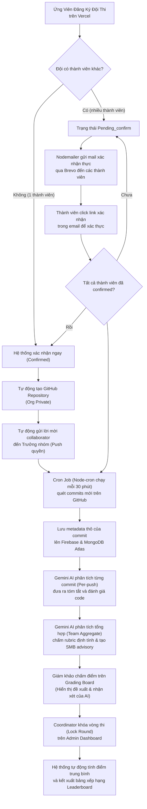

# Hướng Dẫn Vận Hành & Luồng Chạy Sản Phẩm Thực Tế (Production Guide) 🚀

Tài liệu này cung cấp hướng dẫn chi tiết từng bước để cấu hình, triển khai và vận hành hệ thống **SEAL Hackathon Management System** trên môi trường production thực tế sử dụng các dịch vụ Cloud: **Vercel** (Frontend), **Render** (Backend), **MongoDB Atlas** (Database), **Brevo** (Email SMTP), **Google & GitHub OAuth** (Xác thực xã hội) và **Google Gemini API** (Vertex AI/Trợ lý AI).

---

## 📊 1. Sơ Đồ Luồng Hoạt Động Thực Tế (Production Workflow)

Dưới đây là sơ đồ luồng hoạt động tự động hóa 100% của hệ thống trên môi trường Cloud khi vận hành thực tế:



---

## ⚙️ 2. Hướng Dẫn Cấu Hình Biến Môi Trường (Environment Variables)

Để chạy thật (không dùng Mock Simulator), bạn cần khai báo đầy đủ các biến môi trường thực tế tại tệp `server/.env` (Local) và mục **Environment Variables** trên **Render** (Production):

### 2.1 Cấu hình MongoDB Cloud (MongoDB Atlas)
1. Đăng ký tài khoản miễn phí tại [mongodb.com](https://www.mongodb.com/).
2. Tạo một Cluster mới và lấy chuỗi kết nối (Connection String).
3. Cấu hình biến môi trường:
   ```env
   MONGODB_URI=mongodb+srv://<username>:<password>@cluster0.xxxx.mongodb.net/seal-hackathon
   ```

### 2.2 Cấu hình Tự động hóa GitHub (`GITHUB_TOKEN` & `GITHUB_ORG`)
Hệ thống sử dụng GitHub API để tự động tạo repository riêng tư và quản lý cộng tác viên:
1. Vào **GitHub** -> **Settings** -> **Developer settings** -> **Personal access tokens** -> **Tokens (classic)**.
2. Nhấn **Generate new token (classic)**, chọn quyền `repo` và `admin:org`.
3. Lưu lại mã token (`ghp_...`).
4. Cấu hình biến môi trường:
   ```env
   GITHUB_SERVICE_MOCK=false
   GITHUB_TOKEN=ghp_your_personal_access_token_here
   GITHUB_ORG=ten-organization-github-cua-cuoc-thi # Ví dụ: seal-hackathon-2026
   ```

### 2.3 Cấu hình Trợ lý AI Google Gemini (`GEMINI_API_KEY`)
Dùng để phân tích patch code diff của commit và đưa ra gợi ý chấm điểm tự động:
1. Truy cập [Google AI Studio](https://aistudio.google.com/) và tạo một API Key.
2. Cấu hình biến môi trường:
   ```env
   GEMINI_SERVICE_MOCK=false
   GEMINI_API_KEY=AIzaSyyour_gemini_api_key_here
   ```

### 2.4 Cấu hình Gửi Email Thực Tế qua Brevo (`EMAIL_` variables)
Dùng để gửi email lời mời kèm mã xác thực/link kích hoạt thật cho các thành viên:
1. Đăng ký tài khoản tại [Brevo.com](https://www.brevo.com/).
2. Vào **SMTP & API** -> Lấy **SMTP Server** (`smtp-relay.brevo.com`), **Port** (`587`), **Login** (ví dụ: `ac6e22001@smtp-brevo.com`).
3. Tạo một **SMTP Key** mới và copy mã (`xsmtpsib-...`).
4. Cấu hình biến môi trường:
   ```env
   EMAIL_SERVICE_MOCK=false
   EMAIL_HOST=smtp-relay.brevo.com
   EMAIL_PORT=587
   EMAIL_USER=ten-dang-nhap-brevo-cua-ban@smtp-brevo.com # Email Login trong Brevo SMTP
   EMAIL_PASS=xsmtpsib-your_brevo_smtp_key_here
   EMAIL_FROM="SEAL Hackathon" <email-dang-ky-brevo-cua-ban@gmail.com> # Phải là email đã xác thực trên Brevo
   ```

### 2.5 Cấu hình Đăng Nhập Mạng Xã Hội (OAuth Client IDs)
Để ứng viên và ban tổ chức có thể đăng nhập bằng tài khoản Google hoặc GitHub thật:
* **Google OAuth**: Tạo OAuth Client ID dạng **Web application** trên [Google Cloud Console](https://console.cloud.google.com/) với redirect URI là domain Vercel của bạn.
* **GitHub OAuth**: Tạo OAuth App trên **GitHub Settings** -> **Developer settings** -> **OAuth Apps** với Callback URL là `https://your-vercel-domain.vercel.app/login`.
* Cấu hình biến môi trường trên Render:
   ```env
   GOOGLE_CLIENT_ID=your_google_client_id.apps.googleusercontent.com
   GITHUB_CLIENT_ID=your_github_client_id
   GITHUB_CLIENT_SECRET=your_github_client_secret
   JWT_SECRET=supersecretkey123456789!@#
   ```

---

## 🚀 3. Quy Trình Deploy Thực Tế Từng Bước

### 3.1 Deploy Backend trên Render
1. Đăng nhập [Render.com](https://render.com/) -> Chọn **New +** -> **Web Service**.
2. Kết nối tới repo GitHub `seal-management-system`, chọn nhánh **`dev`**.
3. Cấu hình:
   * **Root Directory**: `server`
   * **Build Command**: `npm install`
   * **Start Command**: `node ./bin/www`
4. Vào tab **Environment**, nhập toàn bộ các biến môi trường cấu hình thực tế ở mục 2.
5. Nhấn **Create Web Service**. Khi deploy hoàn tất, lưu lại địa chỉ URL của Backend (ví dụ: `https://seal-backend.onrender.com`).

### 3.2 Deploy Frontend trên Vercel
1. Đăng nhập [Vercel.com](https://vercel.com/) -> Chọn **Add New...** -> **Project**.
2. Kết nối tới repo GitHub `seal-management-system`.
3. Cấu hình:
   * **Root Directory**: Chọn thư mục `client`.
   * **Framework Preset**: Chọn **Vite**.
   * **Build Command**: `npm run build`
   * **Output Directory**: `dist`
4. Thêm một biến môi trường duy nhất:
   * **Key**: `VITE_API_URL`
   * **Value**: `https://seal-backend.onrender.com` *(Địa chỉ URL Render vừa deploy)*
5. Nhấn **Deploy**. Hệ thống sẽ tự động build và cấp phát domain cho bạn (ví dụ: `https://seal-client.vercel.app`).

### 3.3 Thiết lập Webhook/CI CD Tự Động Deploy
1. Trên Render Web Service -> Chọn **Settings** -> Copy địa chỉ **Deploy Hook** URL.
2. Trên Vercel Project -> Chọn **Settings** -> **Git** -> Tạo **Deploy Hook** mới và copy URL.
3. Vào Repo GitHub của bạn -> **Settings** -> **Secrets and variables** -> **Actions** -> Thêm 2 Secrets:
   * `RENDER_DEPLOY_HOOK_URL` = *(URL Render Deploy Hook)*
   * `VERCEL_DEPLOY_HOOK_URL` = *(URL Vercel Deploy Hook)*
*Kể từ bây giờ, mỗi khi bạn push hoặc merge code vào nhánh `dev`, GitHub Actions sẽ tự động kiểm tra cú pháp và kích hoạt deploy phiên bản mới lên Cloud mà không cần thao tác thủ công!*

---

## 🛠️ 4. Hướng Dẫn Vận Hành Hệ Thống Cho Ban Tổ Chức (BTC)

Khi toàn bộ hệ thống đã chạy thật trên môi trường Production, BTC vận hành cuộc thi theo luồng nghiệp vụ chuẩn như sau:

### Bước 1: Tạo và xuất bản cuộc thi
1. Admin đăng nhập vào trang **Admin Dashboard** trên Vercel.
2. Vào mục **Tạo sự kiện mới (Create Event)**, điền tên cuộc thi (Ví dụ: `SEAL Hackathon Spring 2026`) và điền tên **GitHub Organization** dùng để chứa các repo của thí sinh.
3. Sự kiện mới sẽ ở trạng thái nháp (`Draft`). BTC chỉnh sửa và cập nhật trạng thái sự kiện sang **`Registration`** để mở cổng đăng ký cho thí sinh.

### Bước 2: Thiết lập Đề thi & Rubric chấm điểm
1. BTC tạo các bảng đấu chuyên môn (Ví dụ: `Web Application Development`).
2. Tải đề thi/tài liệu đính kèm lên sự kiện.
3. Tạo các **Vòng thi (Rounds)** và tạo **Rubric chấm điểm** chi tiết chứa các Tiêu chí chấm điểm (Criteria) kèm theo trọng số (Weight) và mô tả chi tiết.
4. Nhấn **Khóa Rubric (Lock Rubric)** để lưu cố định khung đánh giá trước khi Giám khảo tiến hành chấm điểm.

### Bước 3: Giám sát Đội thi & GitHub Sync
1. Khi các đội đăng ký thành công và kích hoạt email thật, hệ thống sẽ tự động gọi GitHub API để cấp phát các Repository riêng tư.
2. BTC có thể giám sát toàn bộ danh sách kho lưu trữ của các đội thi tại bảng **Quản lý GitHub Repositories** trên Admin Dashboard.
3. Trình quét tự động (`cronService.js`) sẽ chạy ngầm **mỗi 30 phút** để tự động kéo các commit mới nhất của thí sinh và kích hoạt AI phân tích.
4. BTC có thể chủ động nhấn nút **Đồng bộ thủ công (Manual Sync)** hoặc **Liên kết Repo ngoài** đối với bất kỳ đội thi nào ngay trên bảng quản lý để ép hệ thống kéo dữ liệu ngay lập tức.

### Bước 4: Chấm điểm bằng AI Trợ lý & Khóa bảng xếp hạng
1. Giám khảo truy cập vào trang **Grading Board**, chọn đội thi và vòng thi cần chấm.
2. Hệ thống sẽ tự động hiển thị **AI Insight Panel** ở thanh sidebar bên cạnh Rubric. Bảng này hiển thị gợi ý điểm số (ví dụ: `8.5/10`), nhận xét định tính R1/R2 và bộ câu hỏi phản biện của Gemini AI dựa trên mã nguồn thực tế của thí sinh.
3. Giám khảo tham khảo thông tin AI đề xuất để chấm điểm chính thức.
4. Sau khi chấm điểm xong, Coordinator của BTC nhấn **Khóa vòng thi (Lock Round)**. Hệ thống sẽ tự động chốt điểm số, tính điểm trung bình và xuất kết quả xếp hạng lên **Leaderboard** công khai cho thí sinh theo thời gian thực!

---
Tài liệu hướng dẫn vận hành production này được biên soạn độc quyền cho dự án **SEAL Hackathon**. Chúc cuộc thi diễn ra thành công tốt đẹp! 🚀
